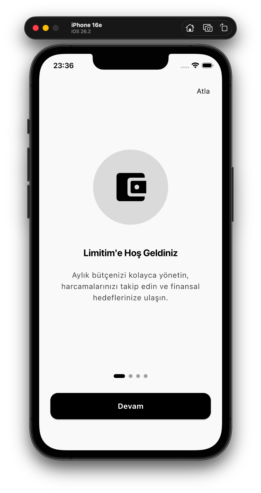
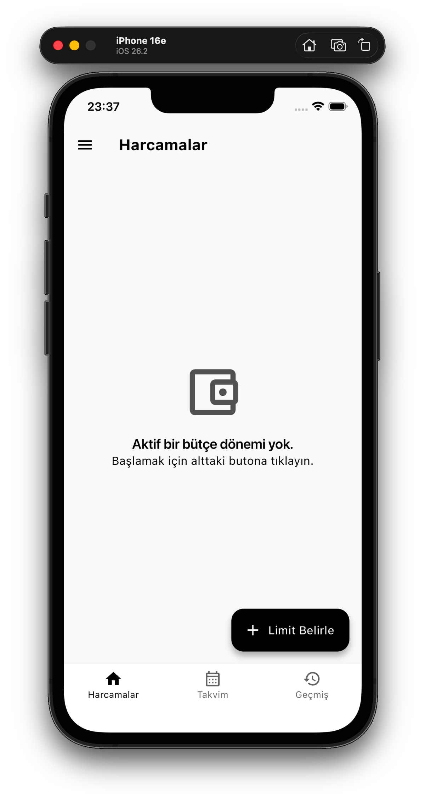
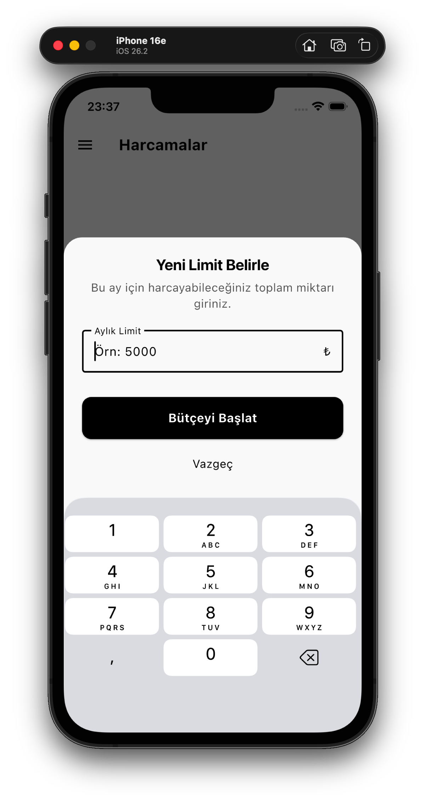
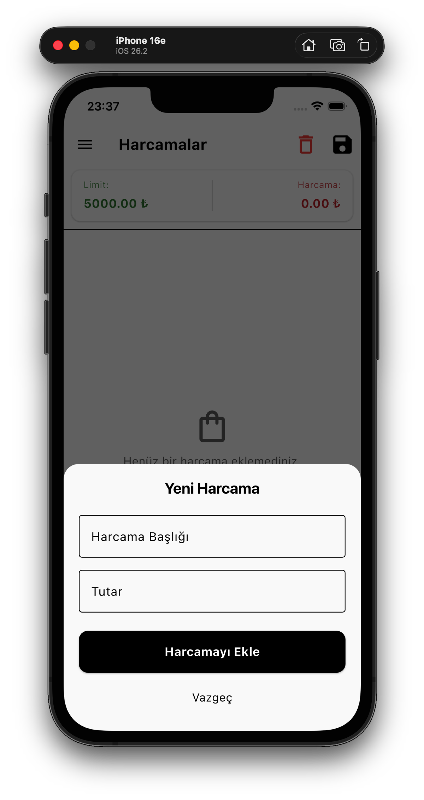
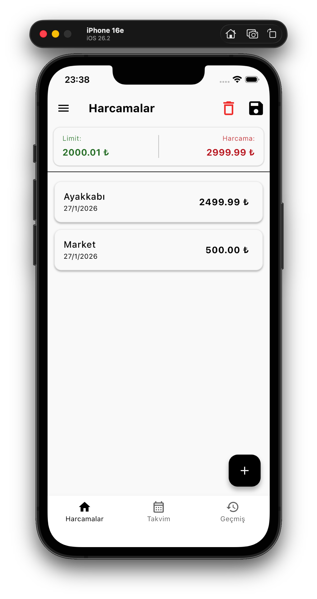
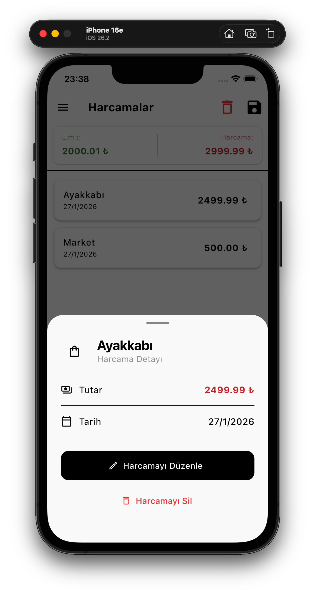
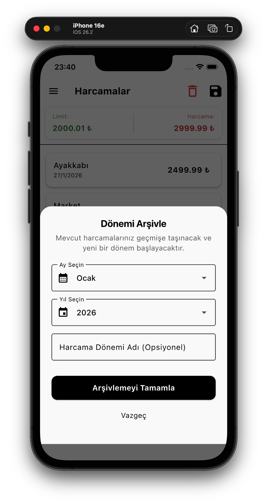
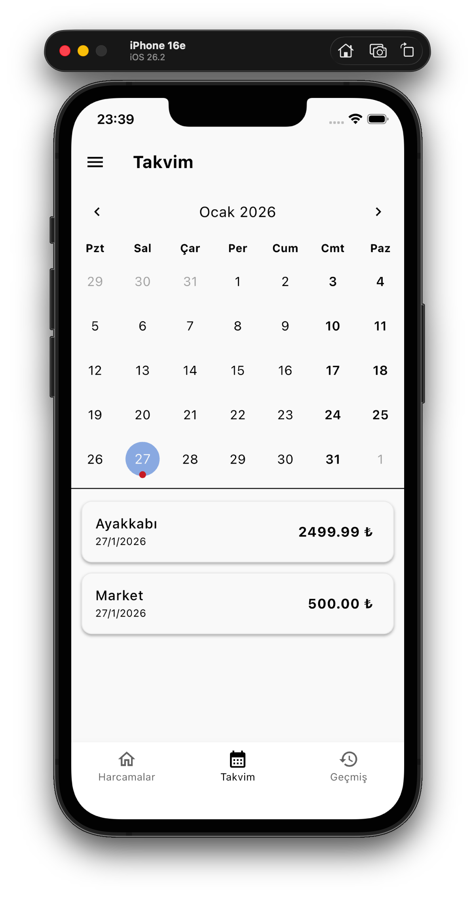
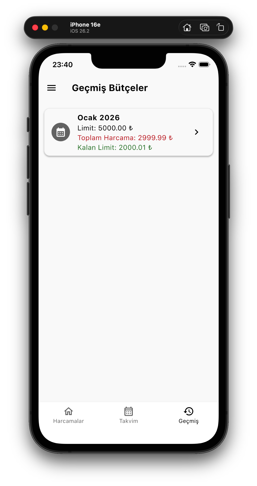
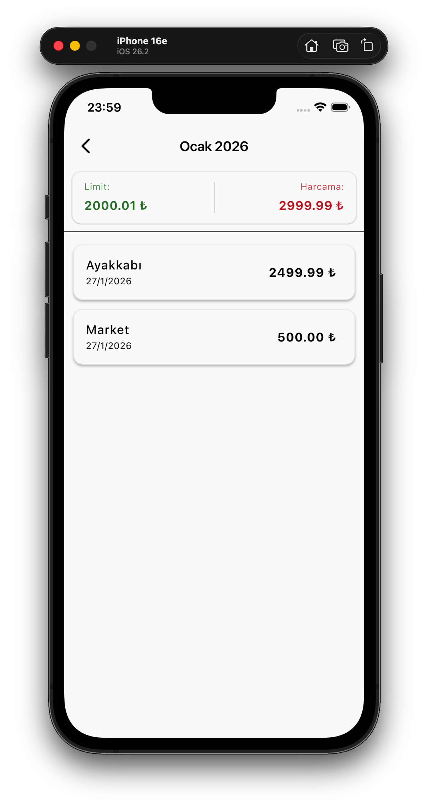

# Limitim 💰

<p align="center">
  
  
  
  
</p>

<p align="center">
  <strong>Modern ve kullanıcı dostu bir aylık bütçe takip uygulaması</strong><br>
  Harcamalarınızı kolayca yönetin, limitinizi belirleyin ve finansal hedeflerinize ulaşın.
</p>

---

## 📱 Genel Bakış

**Limitim**, aylık harcamalarınızı takip etmenizi ve bütçenizi yönetmenizi sağlayan minimalist bir mobil uygulamadır. Karmaşık özelliklerden uzak, kullanımı kolay ve etkili bir bütçe takip deneyimi sunar.

### Neden Limitim?

- 🎯 **Basit ve Etkili**: Karmaşık kategoriler veya hesaplamalar yok, sadece limit belirle ve takip et
- 🚀 **Hızlı Kullanım**: Harcama eklemek saniyeler alır
- 📊 **Görsel Geri Bildirim**: Bütçenizi bir bakışta görebilirsiniz
- 🌙 **Modern Tasarım**: Material Design 3 ile koyu/açık tema desteği
- ♿ **Erişilebilir**: Özelleştirilebilir yazı boyutları ile herkes için ulaşılabilir
- 🇹🇷 **Türkçe**: Tamamen Türkçe arayüz

---

## 🎨 Ekran Görüntüleri

<table table-layout="fixed" width="100%">
  <thead>
    <tr>
      <th width="20%"></th>
      <th width="20%"></th>
      <th width="20%"></th>
      <th width="20%"></th>
      <th width="20%"></th>
    </tr>
  </thead>
  <tbody>
    <tr>
    <td align="center">
        <br>
        <sub><b>Onboard Sayfası</b></sub>
      </td>
      <td align="center">
        <br>
        <sub><b>Ana Sayfa</b></sub>
      </td>
      <td align="center">
        <br>
        <sub><b>Yeni Dönem Başlatma</b></sub>
      </td>
      <td align="center">
        <br>
        <sub><b>Yeni Harcama Ekleme</b></sub>
      </td>
      <td align="center">
        <br>
        <sub><b>Harcamalar</b></sub>
      </td>
    </tr>
    <tr>
      <td align="center">
        <br>
        <sub><b>Harcama Detayı</b></sub>
      </td>
      <td align="center">
        <br>
        <sub><b>Dönemi Kaydet</b></sub>
      </td>
      <td align="center">
        <br>
        <sub><b>Takvim Görünümü</b></sub>
      </td>
      <td align="center">
        <br>
        <sub><b>Geçmiş Görünümü</b></sub>
      </td>
      <td align="center">
        <br>
        <sub><b>Geçmiş Detay Görünümü</b></sub>
      </td>
    </tr>
  </tbody>
</table>

---

## ✨ Ana Özellikler

### 1. 💵 Bütçe Yönetimi

Aylık harcama limitinizi belirleyin ve gerçek zamanlı olarak takip edin.

#### Özellikler:

- **Aylık Limit Belirleme**: Her ay başında veya istediğiniz zaman limit belirleyebilirsiniz
- **Canlı Takip**: Kalan bütçeniz ve toplam harcamanız her zaman görünür
- **Renkli Göstergeler**:
  - 🟢 Yeşil: Kalan bütçe
  - 🔴 Kırmızı: Yapılan harcama
- **Limit Güncelleme**: Mevcut dönemde limitinizi istediğiniz zaman değiştirebilirsiniz
- **Dikey Düzen**: Büyük yazı boyutlarında bile rahatlıkla okunabilir etiket/değer ayrımı

#### Nasıl Kullanılır:

1. Ana ekranda "Yeni Limit Belirle" butonuna tıklayın
2. Aylık harcama limitinizi girin (örn: 5000 ₺)
3. "Bütçeyi Başlat" ile döneminizi başlatın
4. Kalan bütçenizi ve harcamanızı üst kısımda göreceksiniz

---

### 2. 📝 Harcama Takibi

Tüm harcamalarınızı kolayca ekleyin, düzenleyin ve takip edin.

#### Özellikler:

- **Hızlı Ekleme**: Floating Action Button (+) ile hızlı ekleme
- **Basit Form**:
  - Harcama başlığı/açıklaması
  - Tutar (₺)
  - Otomatik tarih kaydı
- **Harcama Listesi**: Tüm harcamalarınız kronolojik sırada
- **Detay Görünümü**: Her harcamanın tam bilgilerine erişim
- **Düzenleme**: Kayıtlı harcamaları güncelleme
- **Silme Seçenekleri**:
  - Kaydırarak silme (swipe to delete)
  - Detay sayfasından silme
- **Tutar Gösterimi**: Harcama miktarları bold ve net görünür

#### İpuçları:

- Virgül veya nokta kullanabilirsiniz (5,50 veya 5.50)
- Başlık otomatik olarak büyük harfle başlatılır
- Tarih otomatik olarak bugün olarak atanır

---

### 3. 📅 Takvim Görünümü

Harcamalarınızı takvim üzerinde görselleştirin ve günlük takip yapın.

#### Özellikler:

- **Aylık Takvim**: TableCalendar widget'ı ile profesyonel takvim görünümü
- **Harcama İşaretleyicileri**: Harcama yapılan günler takvimde işaretlenir
- **Ay Navigasyonu**: Kolayca önceki/sonraki aya geçiş yapın
- **Günlük Filtreleme**: Belirli bir tarihin harcamalarını görün
- **Görsel Vurgulama**:
  - Bugün vurgulanır
  - Seçili gün vurgulanır
  - Harcama yapılan günler işaretlenir
- **Türkçe Yerelleştirme**: Ay ve gün isimleri Türkçe

#### Kullanım Senaryoları:

- Hangi günlerde daha çok harcama yaptığınızı görmek
- Belirli bir tarihteki harcamaları incelemek
- Aylık harcama dağılımını görselleştirmek

---

### 4. 📚 Geçmiş ve Arşiv

Tamamlanmış bütçe dönemlerinizi saklayın ve analiz edin.

#### Özellikler:

- **Dönem Kaydetme**: Ay sonunda döneminizi arşive taşıyın
- **Özel İsimlendirme**: Dönemlerinize özel isimler verin (örn: "Ocak 2026 - Tatil Ayı")
- **Dönem Detayları**:
  - Belirlenen limit
  - Toplam harcama
  - Tüm harcama listesi
  - Dönem tarihi (ay/yıl)
- **Salt Okunur Mod**: Arşivlenmiş harcamalar sadece görüntülenir (düzenleme/silme yapılamaz)
- **Kronolojik Sıralama**: En yeni dönemden en eskiye
- **Harcama Analizi**: Geçmiş alışkanlıklarınızı inceleyin

#### Dönem Kaydetme Akışı:

1. Ay sonu geldiğinde üst menüden "Dönemi Kaydet"e tıklayın
2. İsteğe bağlı özel bir isim verin
3. "Onayla" ile kaydedin
4. Harcamalarınız otomatik olarak arşive taşınır
5. Yeni bir dönem için limit belirleme ekranı açılır

---

### 5. 🎨 Tema Yönetimi

Uygulamayı tercihinize göre özelleştirin.

#### Tema Seçenekleri:

- 🌞 **Açık Mod (Light Mode)**: Gündüz kullanım için ideal
- 🌙 **Koyu Mod (Dark Mode)**: Gece kullanımı ve OLED ekranlar için
- 🔄 **Sistem Ayarı**: Telefonunuzun tema ayarını takip eder

---

### 6. ♿ Erişilebilirlik - Yazı Boyutu Ayarı

Görme zorluğu yaşayan kullanıcılar için özelleştirilebilir metin boyutları.

#### Özellikler:

- **Geniş Aralık**: %80 - %150 arası 14 farklı boyut seçeneği
- **Hassas Kontrol**: Slider ile kolay ve hassas ayarlama
- **Canlı Önizleme**: Değişiklikleri anında görebilirsiniz
- **Yüzde Göstergesi**: Mevcut boyut oranını görün
- **Varsayılana Dön**: Tek tıkla %100'e dönüş butonu
- **Kapsamlı Uygulama**:
  - Tüm metin içerikleri
  - Buton etiketleri
  - Navigation bar ikon ve yazıları
  - AppBar başlıkları
  - Liste öğeleri
  - Dialog ve bottom sheet'ler

#### Akıllı UI Adaptasyonu:

- **Dikey Düzen**: LimitView widget'ında büyük yazılarda etiket ve değerler alt alta dizilir
- **FittedBox**: Taşma durumlarında otomatik ölçekleme
- **Dinamik İkon Boyutları**: Navigation bar ikonları da scale olur
- **Renk İnheritance**: Buton renkleri doğru şekilde inherit edilir

#### Kullanım:

1. Ayarlar → "Yazı Boyutu"
2. Slider'ı hareket ettirin
3. Önizlemeyi kontrol edin
4. İstediğinizde "Varsayılana Dön" butonu

---

### 7. 🎓 Onboarding - İlk Kullanım Tanıtımı

Yeni kullanıcılar için interaktif 4 sayfalık uygulama tanıtımı.

---

### 8. 🎬 Splash Screen - Uygulama Başlatma

Uygulama açılırken gösterilen özel splash screen ile profesyonel bir kullanıcı deneyimi.

#### Özellikler:

- **🎨 Özel Tasarım**: App icon (`assets/icon.png`) ile markalı görünüm
- **🌓 Dark/Light Mode Uyumlu**: Her iki temada da uyumlu arka plan
- **🔄 Loading Indicator**: Yeşil renkli animasyonlu yükleme göstergesi
- **⚙️ Arka Plan İşlemler**:
  - Hive database initialization
  - Adapter kayıtları (Month, Expense)
  - Box açma işlemleri
  - HydratedBloc hazırlık

---

### 9. 💾 Veri Yönetimi

Güvenli ve hızlı yerel veri saklama.

#### Teknolojiler:

- **Hive**: NoSQL yerel veritabanı
- **HydratedBloc**: Otomatik state persistence
- **Path Provider**: Platform bağımsız dosya yolu yönetimi

#### Veri Modelleri:

**Month (Bütçe Dönemi)**

```dart
{
  id: String          // Benzersiz kimlik
  name: String        // Ay adı (Ocak, Şubat, vb.)
  year: int           // Yıl
  limit: double       // Belirlenen limit
  customName: String? // Kullanıcı tanımlı isim
}
```

**Expense (Harcama)**

```dart
{
  id: String       // Benzersiz kimlik
  monthId: String  // Bağlı olduğu dönem ID'si
  title: String    // Harcama başlığı
  amount: double   // Tutar
  date: DateTime   // Harcama tarihi
}
```

#### Veri Operasyonları:

- **CRUD İşlemleri**: Create, Read, Update, Delete
- **İlişkisel Veri**: Expense → Month ilişkisi
- **Otomatik Senkronizasyon**: State değişiklikleri otomatik kaydedilir
- **Veri Bütünlüğü**: Dönem silindiğinde ilişkili harcamalar da silinir

#### Veri Temizleme:

- Ayarlar → "Tüm Verileri Temizle"
- Onay dialogu gerektirir
- Tüm dönemler ve harcamalar silinir
- Geri alınamaz işlem!

---

### 9. 🏗️ State Management (Durum Yönetimi)

BLoC pattern ile temiz ve ölçeklenebilir mimari.

#### BLoC/Cubit Yapıları:

**SessionBloc** 📌

- **Sorumluluk**: Aktif bütçe dönemi yönetimi
- **Events**:
  - `StartNewSession`: Yeni dönem başlat
  - `AddExpenseEvent`: Harcama ekle
  - `UpdateExpenseEvent`: Harcama güncelle
  - `DeleteExpenseEvent`: Harcama sil
  - `UpdateSessionLimit`: Limit güncelle
  - `ResetSessionEvent`: Dönemi sıfırla
- **States**:
  - `ActiveSession`: Aktif dönem var
  - `NoActiveSession`: Aktif dönem yok
- **Veri**: Aktif Month + ilişkili Expense'ler

**HistoryBloc** 📚

- **Sorumluluk**: Tamamlanmış dönemleri yönetme
- **Events**:
  - `LoadHistoryEvent`: Geçmişi yükle
  - `SaveMonthEvent`: Dönemi kaydet
- **States**:
  - `HistoryLoading`: Yükleniyor
  - `HistoryLoaded`: Yüklendi
  - `HistoryError`: Hata
- **Veri**: Month listesi (arşiv)

**CalendarCubit** 📅

- **Sorumluluk**: Takvim görünümü state'i
- **Methods**:
  - `loadMonth`: Belirli bir ayı yükle
  - `selectDate`: Tarih seç
- **States**:
  - `CalendarLoading`: Yükleniyor
  - `CalendarLoaded`: Yüklendi (focusedMonth, selectedDay, expenses)
- **Veri**: Seçili ay ve harcamalar

**ThemeCubit** 🎨

- **Sorumluluk**: Tema tercihi yönetimi
- **Methods**: `updateTheme(ThemeMode)`
- **State**: `ThemeMode` (light, dark, system)
- **Persistence**: HydratedCubit (otomatik kaydedilir)

**TextScaleCubit** 🔤

- **Sorumluluk**: Yazı boyutu tercihi
- **Methods**: `updateScale(double)`
- **State**: `double` (0.8 - 1.5 arası)
- **Persistence**: HydratedCubit
- **Validation**: Min/max değer kontrolü

**OnboardingCubit** 🎓

- **Sorumluluk**: Onboarding tamamlanma durumu
- **Methods**:
  - `completeOnboarding()`
  - `resetOnboarding()`
- **State**: `bool` (completed/not completed)
- **Persistence**: HydratedCubit

#### State Akış Örneği:

```
Kullanıcı Aksiyonu (UI)
        ↓
  Event Dispatch
        ↓
   BLoC Processing
        ↓
  Repository Call
        ↓
   Hive Operation
        ↓
   New State Emit
        ↓
 BlocBuilder Rebuild
        ↓
   UI Update (Widget)
```

---

## 🛠️ Kullanılan Teknolojiler

### Framework ve Dil

- **Flutter**: ^3.0.0 - Cross-platform UI framework
- **Dart**: ^3.0.0 - Programlama dili

### State Management

- **flutter_bloc**: ^8.1.3 - BLoC pattern implementation
- **hydrated_bloc**: ^9.1.2 - Automatic state persistence

### Veri Saklama

- **hive**: ^2.2.3 - Lightweight NoSQL database
- **hive_flutter**: ^1.1.0 - Flutter integration for Hive
- **path_provider**: ^2.1.1 - File system path management

### UI Components

- **table_calendar**: ^3.0.9 - Customizable calendar widget
- **Material Design 3**: Modern design system

### Utilities

- **intl**: ^0.18.1 - Internationalization and date formatting

### Dev Dependencies

- **build_runner**: Code generation
- **hive_generator**: Hive adapter generation

---

## 📖 Kullanım Kılavuzu

### İlk Kullanım

#### Adım 1: Onboarding

- Uygulamayı ilk kez açtığınızda 4 sayfalık tanıtım görünür
- Her sayfayı okuyun veya "Atla" ile geçin
- Son sayfada "Başlayalım" butonuna tıklayın

#### Adım 2: Limit Belirleme

- "Yeni Limit Belirle" butonuna tıklayın
- Aylık harcama limitinizi girin (örn: 5000)
- "Bütçeyi Başlat" ile onaylayın

#### Adım 3: İlk Harcamanızı Ekleyin

- Sağ alttaki (+) FAB butonuna tıklayın
- Harcama başlığı girin (örn: "Market alışverişi")
- Tutarı girin (örn: 250.50)
- "Harcama Ekle" ile kaydedin

### Günlük Kullanım

#### Harcama Ekleme

1. Ana ekranda **FAB (+)** butonuna basın
2. **Başlık** alanına harcama açıklaması girin
3. **Tutar** alanına miktarı girin (virgül veya nokta kullanabilirsiniz)
4. **"Harcama Ekle"** butonuna basın
5. Harcamanız listeye eklenir ve limit güncellenir

#### Harcama Görüntüleme

- Ana ekranda tüm harcamalarınız listelenmiş olarak görünür
- Her item'da başlık, tarih ve tutar bilgisi vardır
- Bir harcamaya **tıklayarak** detay sayfasını açabilirsiniz

#### Harcama Düzenleme

1. Harcamaya **tıklayın** (detay sayfası açılır)
2. **"Harcamayı Düzenle"** butonuna basın
3. Başlık veya tutarı değiştirin
4. **"Harcamayı Güncelle"** ile kaydedin

#### Harcama Silme

**Yöntem 1: Kaydırarak Silme**

1. Harcama item'ında **sola kaydırın** (swipe left)
2. Kırmızı silme butonu görünür
3. Otomatik olarak silinir ve SnackBar gösterilir

**Yöntem 2: Detay Sayfasından**

1. Harcamaya tıklayın
2. **"Harcamayı Sil"** butonuna basın
3. Onay dialogunda **"Evet"** deyin

#### Takvim Görünümü

1. Alt navigasyon bar'dan **"Takvim"** sekmesine geçin
2. Takvimde harcama yapılan günler **işaretli** görünür
3. Bir güne **tıklayarak** o günün harcamalarını görebilirsiniz
4. **Ok tuşları** ile ay değiştirebilirsiniz

#### Limit Güncelleme

1. Ana ekranda üst **menü ikonuna** (üç nokta) tıklayın
2. **"Limiti Güncelle"** seçeneğine basın
3. Yeni limit değerini girin
4. **"Limiti Güncelle"** ile onaylayın

### Ay Sonu İşlemleri

#### Dönemi Kaydetme

1. Ay sonuna geldiğinizde üst menüden **"Dönemi Kaydet"** görünür
2. Bu butona tıklayın
3. (Opsiyonel) Özel bir isim verin (örn: "Ocak 2026 - Tatil Ayı")
4. **"Onayla"** ile kaydedin
5. Harcamalarınız otomatik olarak **Geçmiş** sekmesine taşınır
6. Yeni dönem için limit belirleme ekranı açılır

#### Geçmişi İnceleme

1. Alt navigasyondan **"Geçmiş"** sekmesine geçin
2. Tüm arşivlenmiş dönemleriniz listelenir
3. Bir döneme **tıklayın**
4. Dönem detay sayfası açılır:
   - Limit ve toplam harcama
   - Tüm harcama listesi
   - Salt okunur mod (düzenleme yapılamaz)

### Ayarlar ve Kişiselleştirme

#### Tema Değiştirme

1. Herhangi bir ekranda **sol üst menü** ikonuna tıklayın (drawer açılır)
2. **"Görünüm Ayarları"** seçeneğine basın
3. Tercih ettiğiniz temayı seçin:
   - Açık Mod
   - Koyu Mod
   - Sistem Ayarı
4. Tema anında değişir

#### Yazı Boyutu Ayarlama

1. Drawer'dan **"Yazı Boyutu"** seçeneğine basın
2. **Slider'ı** hareket ettirerek boyutu ayarlayın
3. Canlı önizlemeyi görebilirsiniz
4. **"Varsayılana Dön"** ile %100'e dönebilirsiniz
5. Değişiklik tüm ekranlara yansır

#### Tüm Verileri Temizleme

⚠️ **DİKKAT**: Bu işlem geri alınamaz!

1. Drawer → **"Tüm Verileri Temizle"** (kırmızı)
2. Onay dialogu açılır
3. **Uyarıyı okuyun!**
4. **"Hepsini Sil"** butonuna basın
5. Tüm dönemler ve harcamalar silinir
6. Uygulama başlangıç durumuna döner

---

## 🏗️ Mimari ve Tasarım Prensipleri

### Clean Architecture

Uygulama, Clean Architecture prensiplerine göre katmanlara ayrılmıştır:

```
┌─────────────────────────────────────────┐
│         Presentation Layer              │
│  (Widgets, Screens, BlocBuilders)       │
└────────────┬────────────────────────────┘
             │
┌────────────▼────────────────────────────┐
│       Business Logic Layer              │
│    (BLoC, Cubit, Events, States)        │
└────────────┬────────────────────────────┘
             │
┌────────────▼────────────────────────────┐
│         Data Layer                      │
│  (Repository, Models, Hive Adapters)    │
└─────────────────────────────────────────┘
```

**State Akışı:**

```
User Action (UI Event)
      ↓
Event Dispatched to BLoC
      ↓
BLoC Processes Event
      ↓
Repository Called (if needed)
      ↓
New State Emitted
      ↓
BlocBuilder/BlocListener Reacts
      ↓
UI Updated
```

### Repository Pattern

Veri erişimi için Repository Pattern kullanılır:

```dart
// Soyutlama: UI, veri kaynağını bilmez (Hive, SQLite, API)
HiveRepository
  ├── getExpensesForMonth()
  ├── addExpense()
  ├── updateExpense()
  ├── deleteExpense()
  ├── saveMonth()
  └── getArchivedMonths()
```

### Feature-Based Organization

Proje yapısı feature'lara göre organize edilmiştir:

```
features/
├── expense/     # Harcama ile ilgili her şey
├── calendar/    # Takvim ile ilgili her şey
├── history/     # Geçmiş ile ilgili her şey
└── onboarding/  # Onboarding ile ilgili her şey
```

---

## 📄 Lisans

Bu proje [MIT Lisansı](LICENSE) altında lisanslanmıştır.
